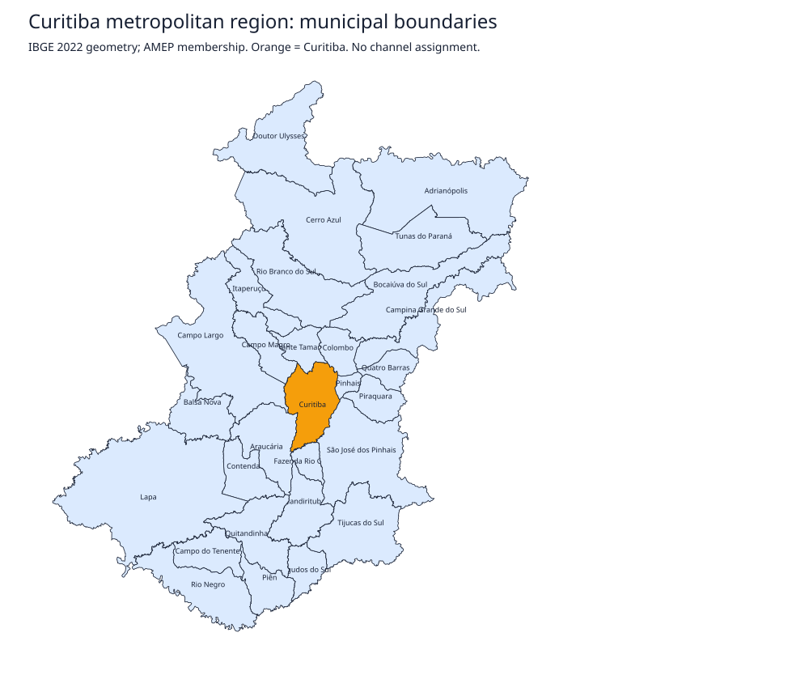

# Curitiba and its metropolitan municipalities

Status: imported and validated geographic inputs, not a channel-allocation result.
Curitiba is one municipality in these maps; city neighborhoods are not separate regions.

| Scenario | Municipalities | Shared-boundary edges | Connected | Planar |
| --- | --- | --- | --- | --- |
| `metropolitan-29.geojson` | 29 | 66 | yes | yes |
| `central-core-14.geojson` | 14 | 29 | yes | yes |

Membership follows [AMEP's metropolitan and Central Urban Core lists](https://www.amep.pr.gov.br/FAQ/Municipios-da-Regiao-Metropolitana-de-Curitiba),
checked on 2026-09-23. Geometry is the **2022** reference period from the
[IBGE geographic boundaries API](https://servicodados.ibge.gov.br/api/docs/malhas?versao=3).
These are different dates: no claim is made that the geometry reflects subsequent boundary changes.
Municipal names and codes are joined from the IBGE locality API. `provenance.json` records
source URLs, hashes, reference period, transformations and dependency versions.

`parana-source.geojson` and `municipalities-source.json` retain the downloaded source
snapshots for offline regeneration. Derived GeoJSON keeps the selected source geometry
unchanged. There is no snapping, simplification, repair or inferred edge insertion.
The `.graph.json` files record derived adjacency and translated factor counts.

Adjacency requires a positive-length shared boundary; corner contact is excluded.
Overlapping interiors, invalid geometry, duplicate identities, disconnected graphs and
nonplanar graphs fail validation. Geometric lengths are used only for a zero/nonzero
topological test, not interpreted as distances in meters. Coordinates remain in the
source geographic longitude/latitude representation.

## Geographic previews

Orange identifies Curitiba, not an assigned channel. Hover titles identify municipalities.
The preview applies an approximate longitude aspect correction for readability; it is not
a surveyed or navigational map. SVGs are explanatory geographic input views, not result figures.

<picture>
  <source media="(prefers-color-scheme: dark)" srcset="../../../docs/assets/img/curitiba-metropolitan-29-dark.svg">
  
</picture>

[Central Urban Core preview](../../../docs/assets/img/curitiba-central-core-14-light.svg)
([dark variant](../../../docs/assets/img/curitiba-central-core-14-dark.svg)).

## Reproduce

From the repository root, install the optional map dependencies:

```powershell
.\.venv\Scripts\python.exe -m pip install -e '.[maps]'
$env:PYTHONPATH = 'software'
.\.venv\Scripts\python.exe -m dcop_channel_assignment.curitiba
.\.venv\Scripts\python.exe -m unittest discover -s tests -p 'test_dcop*.py' -v
```

The build verifies source hashes and regenerates both scenarios, graph summaries and
light/dark SVGs. It does not download or solve channels. Use `--download --data <fresh-directory>`
only to create a new source snapshot; responses may change and must not silently replace
this one. `--figures <directory>` changes preview output placement.

## Wireless interpretation and rights

Geographic boundaries and municipal names are real public data. Each `ap-<IBGE-code>` is
a hypothetical controller representing one municipality, with no real radio location.
Four abstract channels and zero costs are synthetic; the adapter optionally supplies
synthetic shared preferences. Municipality adjacency is not measured wireless interference.

Attribution: IBGE (boundary geometry and locality identifiers); AMEP (membership definition).
The API response does not supply a separate license identifier. Source data is retained
with attribution and is not represented as authored here or relicensed under the software's
MIT license. IBGE describes public access in its
[official dissemination principles](https://www.ibge.gov.br/acesso-informacao/institucional/documentos-ibge/1861-novo-portal/institucional/16150-principios-fundamentais-das-estatisticas-oficiais-orientacoes-para-divulgacoes-de-resultados-pelo-ibge.html).

The 14-region core is the primary geographic demonstration map. The full 29-region map is
the demonstration's limit case: with a 1,000,000-entry table budget, upward UTIL propagation
stops with `budget_exceeded` under either tested root, and its next join would need
4,194,304 or 16,777,216 entries. See the
[study design](../../../docs/dcop-channel-assignment/README.md#demonstration-and-validation-instances).
