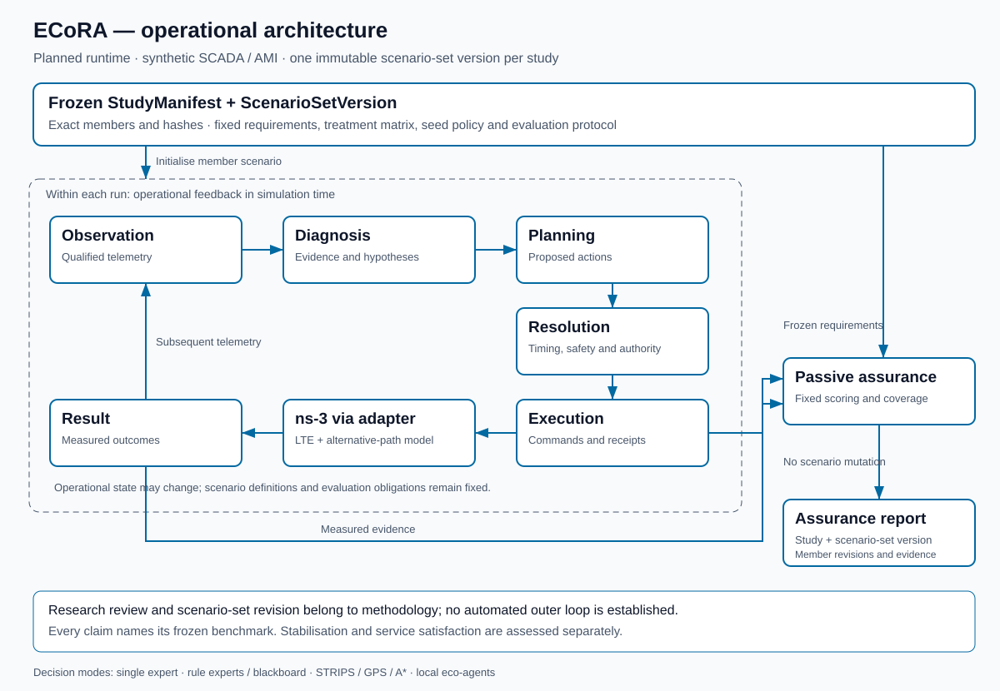

# ECoRA — Expert Coordination, Resolution, and Assurance

**Status: planned architecture; v1 scope selected. Revision: 0.4. Date: 2026-09-21.**

## What is ECoRA?

**ECoRA means Expert Coordination, Resolution, and Assurance. It is a simulation-based research architecture and experimental framework for measuring how observation, reasoning, planning and agent coordination contribute to autonomous network control and evidence-backed service assurance.** Its stages are replaceable interfaces: each has Null, Proposed and Oracle providers, with serialised, logged messages for replay and controlled ablation.

ECoRA is the framework that hosts single experts, blackboard-controlled rule experts, STRIPS/GPS/A* planning and eco-problem-solving agents. Eco-problem solving is one method within ECoRA, not its entire definition. Its first application is synthetic SCADA/AMI competition over wireless backhaul between site and central aggregation gateways, using an ns-3 LTE transport leg and an abstract alternative path. Field access networks are outside scope. It remains a planned research system, not a deployed network controller.

For system presentation: **without failure labels available to the controller, how can knowledge-based diagnosis, symbolic recovery planning and local conflict resolution be integrated into an auditable control loop, with outcomes verifiable through evidence, over a simulated wireless backhaul network?** Privileged references and the evaluator retain only their declared truth access.

The research question is: **under which workload, resource and observability conditions do expert reasoning, planning and local agent coordination improve the maintenance or recovery of declared SCADA and AMI service requirements over fixed and trivial control baselines, and how much of the remaining performance gap is attributable to decision methods versus available information?** The [research framing](../../research/research-questions.md) defines the comparisons, success criteria and claim boundaries.

ECoRA separates two nested loops with different clocks and authority:

- **Inner operational loop, within a run (seconds of simulation time):** telemetry → diagnosis → plan → resolution → action → result → subsequent telemetry. Timing, safety and actuator authority constrain this loop.
- **Outer experimental loop, across studies (typically days of research work):** assurance reports → research review → candidate scenario-set v2 → freeze a new study → evaluate. This is methodology, not an automated runtime feedback path.

Each study freezes one scenario-set version before comparative measurement. All its runs instantiate members of that set, and every claim names the study, scenario-set version and relevant scenario revisions. Scenario-set v2 cannot replace v1 during an active study. A candidate successor is not evidence of improvement; controller improvement must be measured against the same frozen benchmark.

## Framework elements

Symbolic diagnosis, automated planning, expert coordination, self-organising resolution and simulated measurement are *methods* and *treatments* within one instrumented pipeline, not separate systems. Hosting them together is what makes them comparable: every method is exercised against the same scenarios, the same action space and the same assurance metrics.

| Element | Role in ECoRA |
| --- | --- |
| Decision methods | Rule-based diagnosis, STRIPS and GPS planning, A* search |
| Coordination | How multiple knowledge sources contribute to a shared solution state |
| Resolution | How competing proposals are reduced to a decision, by central arbitration or local self-organisation |
| Assurance | Evaluation of service requirements against evidence, scoped to a frozen study |
| The plant | ns-3 behind an anti-corruption layer, supplying telemetry and applying actions |

Coordination and Resolution are **concerns applied across the loop**, not single stages — candidates compete at diagnosis, at planning and at execution. Treating them as cross-cutting is what turns *expert* and *eco* modes from two incomparable architectures into two settings of one ablatable factor.

Every stage binds a provider through configuration rather than code, in three arms:

| Arm | What it is | What it measures |
| --- | --- | --- |
| **Null** | A degenerate policy — first match, first feasible action, no planning | Whether the stage contributes at all |
| **Proposed** | The method under study | How much it contributes |
| **Oracle** | Declared simulator truth, with its privileges explicitly labelled | How much conditional headroom remains |

The Oracle arm carries the load that matters most here. If an Oracle diagnoser barely beats the Proposed one, the bottleneck may not be the method — it may be the telemetry. Establishing that requires the comparisons in [Stage arms](stage-arms.md#information-sufficiency-and-bottleneck-attribution); a small gap alone does not identify the limiting factor. Because every stage invocation logs its typed inputs and outputs, a stage can also be replayed in isolation.

Every method here is a **baseline**, not a presumed solution. Future controllers, including optimisation-based, learning-based, digital-twin-assisted and security-aware mechanisms, are evaluated as additional treatments against the same frozen scenario set and the same assurance metrics.

## Reading guide

| Document | Purpose |
| --- | --- |
| [Selected v1 scope](v1-scope.md) | Backhaul model, workload semantics, agents, safety, finite references and execution budget |
| [Architecture](architecture.md) | DDD context map, ownership, aggregates, deployment and control loop |
| [Domain and ontology](ontology.md) | Ubiquitous language, relations, epistemic distinctions and constraints |
| [Ontology vocabulary](ontology.ttl) | Machine-readable RDF/OWL vocabulary; a design artifact, not a deployed reasoner |
| [Contracts](contracts.md) | Scenario, telemetry, diagnosis, planning, resolution, execution and assurance interfaces |
| [Stage arms and oracles](stage-arms.md) | Null/Proposed/Oracle substitutions, conditional headroom and telemetry sufficiency |
| [Normative interfaces](../../system/interfaces.md) | Provider seams, serialisation, stage datasets and replay |
| [Telemetry contract](../../system/telemetry-contract.md) / [Action contract](../../system/action-contract.md) | Observation permissions and actuation authority shared by every arm |
| [Decision methods](decision-methods.md) | Single expert, rule experts, STRIPS, GPS, A* and eco-problem solving |
| [Methodology](methodology.md) | Nested time scales, study-level freeze, research revision and cross-version comparison |
| [Experiments and ablation](experiments.md) | Scenario family, hypotheses, comparisons, metrics and validity criteria |
| [Evidence and decisions](evidence-and-decisions.md) | Evidence policy, capability boundaries, architectural decisions and implementation sequence |

Diagrams are embedded as Mermaid for review. The overview also has canonical SVG exports in light and dark themes under `docs/assets/img/`.

<picture>
  <source media="(prefers-color-scheme: dark)" srcset="../assets/img/ecora-architecture-dark.svg">
  
</picture>

## Scope and evidence boundary

ECoRA is specified as a new system. All runtime capabilities described here are **planned** and require implementation and reproducible evidence in this repository. This documentation introduces no runtime implementation or experimental result. The interfaces, telemetry and action documents in `system/` are normative design specifications; other system documents remain placeholders. Executable schemas and providers are not yet implemented.

The initial scope includes synthetic traffic competition, explainable decisions, local coordination, action conflicts, reproducible simulation, and service assurance. Claims about a particular radio band, deployment type, SCADA/AMI protocol compliance, production network control or convergence require their own explicit models and validation.

No architectural novelty is claimed. The control loop instantiates MAPE-K and related closed-loop reference models, the coordination design follows the blackboard architecture, and the decision methods are classical formulations. See [Relationship to established reference models](architecture.md#relationship-to-established-reference-models). The work's substance is the instantiation discipline — contracts, a frozen benchmark and ablation evidence — not the shape of the loop.

Use **LTE plus an abstract alternative radio path** when describing the proposed initial model. Use **multi-RAT** as the research direction; a point-to-point surrogate does not demonstrate a second radio access technology. Radio-frequency and deployment claims must follow from the selected model and executed configuration.

Eco-problem solving here means local satisfaction-seeking agents whose interactions may stabilise into a collective solution. It does not mean ecological sustainability or energy optimisation. Energy can become a later objective only with an explicit measurement model.

## Architectural acceptance criteria

- Every conclusion follows study → scenario → run → stage → dataset, including frozen scenario-set version/hash, provider/arm, observation window and method version.
- Every stage has contract-compatible Null, Proposed and Oracle providers selected by configuration; ablation never deletes a stage.
- Every inter-stage message is serialisable and logged; action-changing replay requires a new simulator continuation for outcome claims.
- Oracle access is explicit and logged; component headroom and telemetry sufficiency are distinct claims.
- The operational loop changes allowed run state; it cannot change the study's scenario set, requirements or scoring policy.
- Research revision happens outside runtime control and produces a new scenario-set version for a new study.
- Observations, hypotheses, predicted effects, applied actions and measured outcomes remain distinct.
- Each enabled action has an adapter implementation and a declared observation of its application.
- A single expert and a blackboard of one-rule experts can be compared with the same rules and inputs.
- STRIPS representation, GPS means–ends planning and A* search have explicit, separate roles.
- Eco-agents have bounded local information and actions; a global monitor cannot choose their actions.
- Stable starvation is reported as failure to meet service requirements.
- Ablations and failed or inconclusive runs are retained alongside successful runs.

All entities and example identifiers in this package are synthetic. Numeric experimental settings are owned by the single parameter register in [Experiments](experiments.md#parameter-register); no settings here claim calibration.

## Quick start

**No executable software has landed yet, so there is nothing to install.** ECoRA exists as specification: contracts, methodology and experimental design. Clone the repository and read:

```bash
git clone https://github.com/fsd-dantas/ai4winets.git
cd ai4winets/docs/ECoRA
```

A reading order, for someone arriving at the framework for the first time:

1. [What is ECoRA](#what-is-ecora) and [Framework elements](#framework-elements) — the two loops, the stages and their three arms.
2. [Selected v1 scope](v1-scope.md) — what the first version simulates, observes, controls and claims.
3. [Contracts](contracts.md) and [Normative interfaces](../../system/interfaces.md) — the seams every arm binds, with the [telemetry](../../system/telemetry-contract.md) and [action](../../system/action-contract.md) contracts that bound what any provider may see and do.
4. [Experiments and ablation](experiments.md) — the comparisons, and [Methodology](methodology.md) for the freeze rules that scope what they can claim.

The [research question and scope](../../research/research-questions.md) sits above all of this: it states what is being asked, and the boundary of what this framework's evidence could support. The remaining documents under [`system/`](../../system/) are placeholders awaiting adoption of these contracts into executable form.

When software arrives, two environments will apply: the Python package on any supported Python environment, and the ns-3 wireless-backhaul experiment on Linux, with Ubuntu or WSL2 as the documented setup path. Each experiment directory will carry the README stating its exact execution and validation procedure.

A successful installation is not validation of an experiment. A result is confirmed by reproducing the documented command, comparing the stated outputs, and reading the experiment's limitations.
