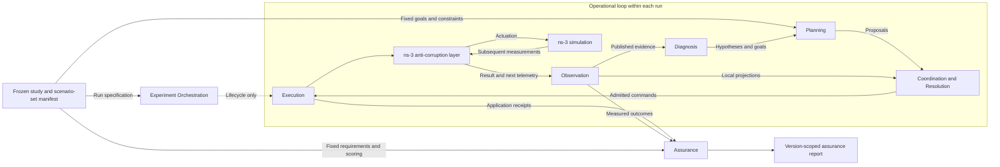
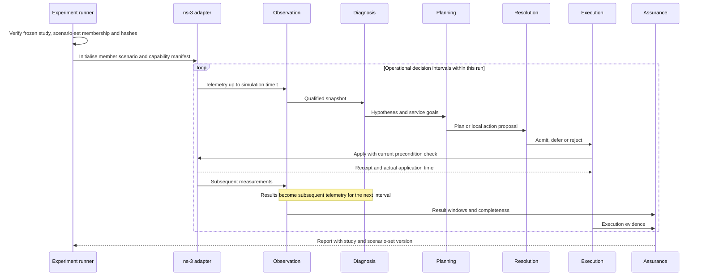
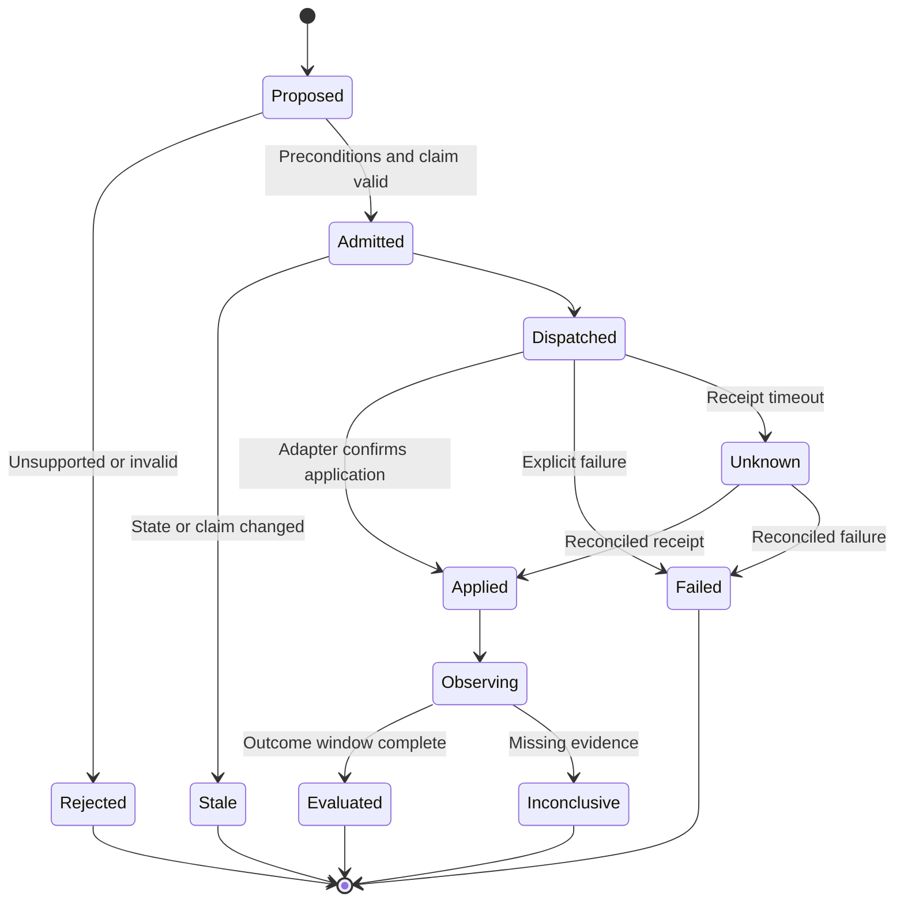

# Architecture and domain boundaries

**Status: planned.** [Index](README.md)

## Purpose and domain decomposition

The [selected v1 application](v1-scope.md) controls wireless backhaul between site and
central aggregation gateways. Field access networks are outside this model. Ordinary
controllers receive operational observations without injected-failure labels.

The core domain is choosing and coordinating explainable interventions under partial observation, then assessing their service consequences. Simulation, artifact storage and experiment scheduling support that domain. An expert system is a deterministic symbolic component in this proposal; no language model or external service is required.

ECoRA begins as a modular application with an ns-3 adapter. Bounded contexts express semantic and transactional ownership, not an obligation to deploy microservices. Logical eco-agents can share a process while retaining local information boundaries.

ECoRA is **Expert Coordination, Resolution, and Assurance**: a simulation-based research architecture for measuring the contribution and limits of observation, reasoning, planning and agent coordination to autonomous network control and service assurance. Stages are interfaces; Null, Proposed and Oracle providers bind through configuration. DDD contexts own semantics, while stage ports expose experimental substitution boundaries. A context may own several ports; replacing a provider does not remove that context's invariants.

The operational loop closes within a run, on its declared simulation-time schedule. A frozen study manifest supplies scenario definitions and evaluation constraints. Research review and scenario-set revision operate across studies and are specified in [Methodology](methodology.md). They are not automated components of this architecture. The context map therefore shows configuration inputs and passive assurance output without a report-to-scenario feedback edge.

| Bounded context | Owned concepts and aggregate roots | Responsibility | Does not own |
| --- | --- | --- | --- |
| Study Specification (pre-run supporting context) | Study, ScenarioSetVersion, ScenarioRevision, ParameterSet | Validate and freeze the research-authored scenario set, comparison protocol and capability needs | Automated research revision or observed outcomes |
| Observation | ObservationWindow, TelemetryBatch | Normalisation, provenance, quality and time alignment | Diagnosis truth |
| Diagnosis | DiagnosticCase, ExpertKnowledgeVersion | Hypotheses, evidence, rule traces and contradictions | Applied configuration |
| Planning | PlanningProblem, PlanProposal | Goals, operators, predicted transitions and search traces | Resource admission |
| Coordination and Resolution | ResolutionSession, ResourceClaim, EcoAgentState | Competing proposals, local marks, admission and conflict outcomes | Packet delivery |
| Execution | ActionExecution | Preconditions, dispatch, acknowledgements and compensation | Assurance verdicts |
| Assurance | AssuranceCase, AssuranceReport | Requirement evaluation and claims scoped to the frozen study and scenario set | Controller decisions or scenario-set revision |
| Experiment Orchestration | ExperimentRun, StageInvocation, DatasetArtifact | Enforce study membership, provider bindings, full boundary logging, reproducibility and run completion | Domain reasoning or changing the benchmark |

Resource ownership is scoped to a site, queue or actuator. A ResolutionSession represents either a central arbitration episode or a collection of local coordination events. These are different configured modes with the same audit envelope.

## Relationship to established reference models

ECoRA instantiates existing closed-loop reference models. It does not propose a new control paradigm, and no claim of architectural novelty is made or intended.

| Element | Established model it instantiates |
| --- | --- |
| Observation → diagnosis → planning → execution over shared knowledge | MAPE-K, from autonomic computing |
| Closed-loop service assurance over a managed network | ETSI ZSM closed-loop automation; O-RAN RIC control loops; 3GPP SON |
| Multiple knowledge sources contributing to a shared solution state | Blackboard architecture, after Hearsay-II |
| Operators, preconditions and effects; means–ends analysis; admissible-heuristic search | STRIPS, GPS and A*, as classical AI formulations |
| Bounded contexts, aggregates, anti-corruption layer, ports and adapters | Domain-Driven Design and hexagonal architecture |

The pipeline shape is therefore borrowed and should be read as borrowed. What this work supplies is the instantiation discipline: explicit telemetry, action and assurance contracts that bound what may be observed, what may be acted on and what may be claimed; a benchmark frozen before comparative measurement; and ablation evidence for each declared factor. A reader who recognises MAPE-K in the control loop has recognised it correctly.

This is stated because the repository's capability rules forbid presenting a planned or borrowed element as an original or validated one. Naming the lineage costs nothing and prevents the documentation from implying a contribution it does not make.

## DDD context map

Observation is an upstream supplier of evidence; Diagnosis, Coordination and Assurance consume its published language. Planning and Execution share a versioned action catalog, but neither may mutate the other's records. Assurance is a downstream evidence consumer. Researchers may use its reports in a separate methodological review; report generation does not revise a scenario or start a new study.

The ns-3 adapter is an **anti-corruption layer**: it translates simulator-native traces, identifiers and model limitations into ECoRA domain contracts. Model and deployment claims require explicit capability evidence. The shared kernel is deliberately small: typed identifiers, simulation time, units, provenance, version references and capability status. Domain rules remain inside their contexts.

## Aggregate invariants and consistency

| Aggregate | Invariants |
| --- | --- |
| Study | Exactly one frozen scenario-set version; comparison matrix, seed policy, requirements and analysis protocol fixed before comparative measurement |
| ScenarioSetVersion | Immutable membership in exact scenario revisions with content hashes; selection and aggregation weights fixed; successor versions cannot replace it in an active study |
| ScenarioRevision | Immutable when its set is frozen; all targets exist; required capabilities resolve; parameter reference is fixed |
| ExperimentRun | Exactly one study and member scenario revision from its frozen set; treatment matches the study matrix; independent named random streams; one terminal outcome |
| StageInvocation | One configured interface/provider/version/arm; logged input/state references and typed outputs; Oracle privileges explicit and propagated |
| DatasetArtifact | Immutable content and schema hashes, producing invocation, source datasets and time coverage; empty/error datasets retain provenance |
| ObservationWindow | One run and defined interval; units and source declared; missing values remain missing |
| DiagnosticCase | Every evidence reference resolves; inferred facts retain rule and knowledge versions; contradiction is representable |
| PlanProposal | Operators come from the selected catalog; predicted transitions validate; goals, unmet goals, no-op/partial status and assumptions are explicit |
| ResourceClaim | Resource scope, issuer, expiry and version are explicit; expired claims cannot authorise actions |
| ActionExecution | One logical command per idempotency key; actual application time recorded; acknowledgement is not success |
| AssuranceCase | Each claim names its study and scenario-set version and links to requirements and evidence; insufficient evidence cannot yield a pass |

Transactions stay within an aggregate. Every inter-stage message, including in-process calls and no-ops, uses the serialisable [message envelope](../../system/interfaces.md#message-envelope-and-durable-log) and is durably logged before delivery. A domain event records something that happened; a command requests something that may be rejected. Delivery can be at least once, so consumers deduplicate. Deterministic replay requires the event log, provider versions, ordering policy, named random streams and restorable state. If those prerequisites cannot be met, deterministic continuation is unsupported rather than assumed.

## Stage substitution and evidence lineage

Every stage binds a Null, Proposed or Oracle provider with the same input/output schema. Null policies emit valid degenerate records; they do not disappear. The complete seven-stage arm table and information limits are specified in [Stage arms](stage-arms.md). The initial experiment varies telemetry, diagnosis, planning and resolution while holding execution, result extraction and assurance fixed.

All boundary messages and provider state are accessible through logged ports; shared mutable objects cannot create hidden inputs. The lineage is **study → scenario → run → stage → dataset**, qualified by frozen scenario-set version/hash. The runner validates complete bindings, schema compatibility, Oracle support and evidence-access permissions before admitting a run.

An Oracle TruthPort is a restricted adapter/evaluator projection, not extra telemetry available to every controller. Current-state Oracle use propagates through output lineage. A future-aware Oracle would require a separate treatment. Independent study scoring remains fixed even when the assurance provider is substituted.

Boundary playback sends a recorded stage output to the next interface. Substitution replay sends recorded inputs through another provider; action-changing effects require a fresh simulator continuation. The normative [interfaces](../../system/interfaces.md), [telemetry](../../system/telemetry-contract.md) and [action](../../system/action-contract.md) specifications must precede pipeline code.

## Lifecycle and sequence

For eco mode, Diagnosis is the agent's local dissatisfaction assessment, Planning is its next-action proposal, and Resolution is local interaction with competitors. The lifecycle remains traceable without requiring a central diagnosis or planner.

A Null or Proposed controller cannot consume uncontracted simulator truth, future measurements or the hidden disturbance schedule. Current ground truth is available to the simulator/evaluator and to the initial Oracle providers only through a separately labelled and logged truth interface. The initial Oracle arm has no future access.

The frozen specification can include time-varying traffic, scheduled faults and authorised adaptation. Runtime queues, routes and marks evolve according to that specification; this does not revise the benchmark. Controller permissions never include changing the scenario-set membership, workload definition, evaluation thresholds or scoring population. Action admission enforces timing, safety invariants and authority at dispatch.

## Execution and failure lifecycle

An unknown receipt never triggers blind re-execution. Query the actuator state using the idempotency key. If reconciliation is impossible, stop dependent actions and record uncertainty. Compensation is a new action with new preconditions; restoring a route does not undo packet loss or elapsed delay.

## Ports, adapters and deployment

| Port | Domain-facing operation | Adapter responsibility |
| --- | --- | --- |
| ScenarioPort | validate study membership, initialise | Verify scenario-set hash and member revision; map model to ns-3; reject unsupported requests |
| ObservationPort | read window, local projection | Export traces with measurement semantics and locality |
| ActionPort | capabilities, apply, reconcile | Translate commands; verify target state; emit receipts |
| KnowledgePort | load version | Supply immutable rules, operators and interpretation functions |
| ArtifactPort | append, resolve, checksum | Store manifests, traces and reports without rewriting evidence |
| StagePort | invoke, snapshot, restore | Resolve configured provider; serialise/log all inputs, state and outputs |
| TruthPort | read permitted current truth | Restrict Oracle access, log every request/result, propagate privilege lineage |
| TimePort | simulation now, schedule | Separate simulation time from wall-clock computation time |

The initial runtime can use an in-process coordinator, immutable files and a synchronous simulator barrier. A barrier pauses virtual time while a decision is computed; that is an idealised control-latency mode and must be labelled. A later latency-aware mode schedules actuation after an explicitly modelled decision/communication delay.

Batch replay is also useful, but it is a distinct experiment: a plan learned from one run and replayed into another is not online closed-loop control. A causal prefix-replay mode would need to show that every decision used only its available prefix.

## Operational properties

Every run records its study ID, scenario-set version/hash, scenario revision, software and model versions, knowledge hashes, controller budget, causal event ordering, random streams and artifact checksums. Run artifacts are append-only after closure. Failed runs preserve partial artifacts and a terminal reason. A changed scenario-set hash prevents further runs from being admitted to that study.

Schema evolution is explicit: adapters declare accepted major versions, optional additions preserve interpretation, and incompatible changes require a new major contract version. Ontology evolution must not silently reinterpret old predicates. Renamed concepts retain a documented migration relation.

The first implementation uses one active treatment per run. Hybrid expert/eco treatments are later experiments with explicit authority boundaries; multiple controllers must never silently compete for the same actuator.
