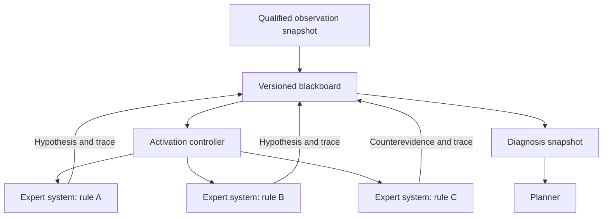
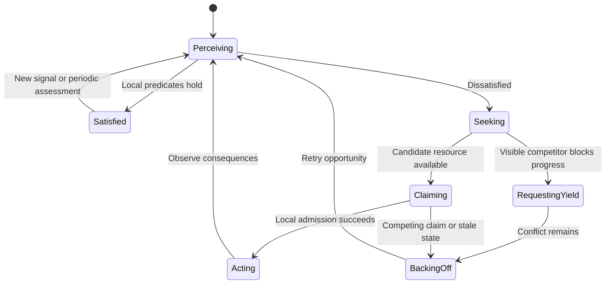

# Decision methods and eco-problem solving

**Status: planned treatments.** [Index](README.md)

The methods occupy different architectural roles. STRIPS is used here as an operator/state representation with an explicit planning algorithm; GPS is a means–ends planner; A* is a search algorithm. A route-search experiment and an action-planning experiment are different comparisons.

These are Proposed providers or within-arm method variants. Each binds a versioned stage interface alongside the Null and Oracle substitutes in [Stage arms](stage-arms.md). Choose one Proposed variant per factor for the initial factorial; compare alternative methods in separately declared cells. All inter-stage messages and state dependencies use the logged contracts in [Interfaces](../../system/interfaces.md).

## Single expert system

One engine evaluates a versioned collection of production rules over an admissible evidence snapshot. A rule declares its input requirements, condition, conclusion, priority, explanation and retraction conditions. It may infer a hypothesis or propose a goal/action, but it cannot mutate the simulator.

Record fired and inhibited rules, supporting observations, contradictory conclusions and the conflict policy. Confidence factors, if used, are scores with declared semantics; they are not probabilities without calibration. The first version may use categorical support to avoid unjustified numeric confidence.

## One expert system per rule, controlled by a blackboard

Each expert owns one production rule and its own activation, evaluation and explanation state. Input normalisation may be shared; hidden additional domain rules may not be shared. A blackboard controller schedules experts and manages evidence dependencies, revision tracking, retractions and termination.

An activation reads a consistent blackboard revision and writes proposed updates carrying that revision. Stale contributions are re-evaluated or rejected. A truth-maintenance dependency graph invalidates conclusions when supporting evidence expires. Termination occurs at a fixed point, a declared activation budget, or an unresolved-conflict outcome.

Use the same rule inventory and conflict policy as the single expert baseline to isolate organisation. First compare both on an immutable snapshot; then measure incremental and asynchronous operation separately. Differences caused by new rules, extra telemetry or different update timing are separate factors.

This blackboard is a central coordination mechanism for experts. It is not the eco-agents' environment and is not evidence of distributed problem solving by itself.

## STRIPS-domain planning

A finite symbolic state is a set of known ground predicates. An operator has preconditions, add effects, delete effects and a declared cost. For applicable action a, the predicted next state is:

`S_next = (S - delete(a)) union add(a)`.

ECoRA's named STRIPS treatment uses forward uniform-cost search over this representation. This gives a clear baseline against A* on the same graph. Goals, action catalog, cost and projected initial state remain fixed across the search comparison. It is an ECoRA design choice, not a claim to reproduce every feature of historical STRIPS.

Predicted effects describe configuration changes rather than asserting future measured service. For example, selecting a path can establish `selected_path(flow, alternate)`; it cannot directly establish `deadline_met(flow)`. A performance goal needs a documented predictive abstraction and subsequent empirical evaluation. With no valid predictor, planners target configuration subgoals while assurance tests actual service.

The projection records unknown predicates separately. Closed-world reasoning is permitted only for an explicitly enumerated, sufficiently observed subdomain; unknown physical conditions must not silently become false.

## GPS: General Problem Solver style planning

The GPS treatment performs means–ends analysis: identify an unmet goal, choose an operator that addresses the difference, recursively satisfy its preconditions, and apply it in the symbolic model. Operator ordering, subgoal ordering, cycle detection, backtracking and effort bounds are part of the treatment specification.

Recheck all goals after constructing the plan because achieving a later subgoal can undo an earlier one. Record the difference selected at every step and each failed branch. A bounded GPS search failure means no plan was found within that method's policy and budget, not proof that the problem is infeasible.

GPS and forward search use the same operator semantics and final plan validator. Their traces and computation costs can be compared even when their search procedures differ.

## A* search

A* ranks states by `f(n) = g(n) + h(n)`. The action-planning treatment searches the same state graph and action costs as the STRIPS uniform-cost baseline. Start with `h = 0` as a correctness reference; introduce a nonzero lower-bound heuristic only after checking its properties on enumerable small problems.

Cost optimality claims require nonnegative costs and the applicable search assumptions, including proper handling of improved paths and the heuristic's admissibility. Weighted heuristics or cutoffs receive separate labels and do not inherit an optimality claim.

A* route search is a separate optional subservice over a declared network graph. Its path cost and constraints must match the routing question. A shortest abstract route is not proof of achievable latency, capacity, or wireless reachability. Keep route search fixed when comparing planner algorithms, or explicitly treat it as an additional factor.

The original STRIPS paper motivates the distinction between represented actions and problem solving: [Fikes and Nilsson, 1971](https://ai.stanford.edu/~nilsson/OnlinePubs-Nils/PublishedPapers/strips.pdf). The algorithms and treatment definitions above are proposed ECoRA contracts, not results inherited from that paper.

## Eco-problem solving

The proposed agent boundary is **one service-class queue at a synthetic edge site**. This keeps SCADA and AMI interests distinct while allowing bounded local control. Agent granularity is a later sensitivity factor, not a settled claim that per-queue control is best.

A local agent owns its internal state, visible signals, interpretation function, satisfaction predicate and candidate actions. It cannot read global queue state, future disturbances or the evaluator's truth labels.

| Element | SCADA agent interpretation | AMI agent interpretation |
| --- | --- | --- |
| Delay increase | Risk to request/response deadline | Risk to delivery age/backlog objective |
| Occupied resource | Possible immediate contention | Possible reason to defer an eligible reading |
| Peer claim mark | Competing local intention | Availability cue subject to expiry and freshness |
| Own growing backlog | Outstanding transactions need service | Accumulated readings require minimum progress |
| Yield request | Evaluate whether local requirements allow yielding | Evaluate deferral eligibility and starvation guard |

Satisfaction is a vector of predicates before it is a scalar score. SCADA may require its deadline-miss and delivery bounds; AMI may require minimum delivered service, bounded reading age and backlog progress. Aggregating them into a utility requires declared weights and a sensitivity analysis.

The local cycle is:

1. Perceive only accessible observations and nonexpired marks.
2. Update internal state and assess satisfaction.
3. Identify a locally observable obstacle or competing claim.
4. Select a permitted local action or publish a bounded request.
5. Resolve competing claims through the chosen local protocol.
6. Observe the outcome and release, renew or abandon marks.
7. Repeat until the run ends; stabilisation is assessed independently.

Classical terms such as aggression and flight are represented here as a yield request and a local concession/backoff. They are coordination messages, not attack traffic. A dissatisfied agent unable to identify an obstacle may simply wait, probe through an allowed action, or report blocked local progress.

### Environmental substrate

A mark carries issuer, resource, intent, visibility neighbourhood, creation time, expiry and version. Example meanings are temporary intent to transmit, observed local congestion, and release of a prior claim. Agents can interpret the same mark differently.

The substrate stores and exposes marks; it does not choose a system-wide allocation. A simulator may host this substrate centrally for implementation convenience, but the read API must enforce local scope and its communication model must be declared. An ideal shared-memory substrate and a delayed/lossy message substrate are distinct treatments.

Measure mark writes, reads, lifetime, conflicts and transport bytes. If marks use a zero-cost ideal substrate, do not claim realistic communication overhead or robustness.

### Anti-collision mechanisms

These mechanisms address **agent action conflicts**, not a simulated radio MAC collision process:

| Mechanism | Local behaviour | Failure mode to test |
| --- | --- | --- |
| Randomised backoff | Delay retry with an agent-specific random stream | Long waits, synchronised retries or starvation |
| Expiring intent marks | Advertise intended use and detect overlapping claims | Stale reads, equal-time races and lease churn |
| Local reservation handshake | Request/grant within a declared neighbourhood | Lost grants, inconsistent beliefs and deadlock |
| Yield with aging | Give way when eligible; increase urgency with waiting | Priority inversion, oscillation or unfair aging |

Evaluate mechanisms separately before combinations. Do not make a global priority arbiter an invisible part of an allegedly decentralised treatment. Actuator consistency checks are allowed, but their rejection counts and policy must be reported.

### Stabilisation and limits

Define stabilisation using the declared rolling window, bounded action/claim churn, bounded allocation changes and persistent service verdicts. Report coordination stability independently from service satisfaction.

No convergence theorem is claimed. Test repeated states, resource oscillation, deadlock, livelock, starvation and sensitivity to activation order, mark expiry, initial allocation and communication delay. A watchdog records failure at the run boundary; it does not secretly install a central solution.
