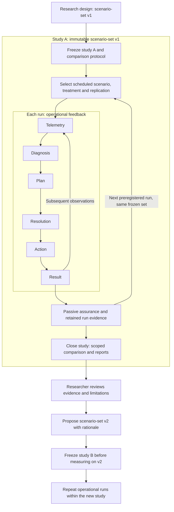

# Nested operational and experimental loops

**Status: planned research methodology.** [Index](README.md)

ECoRA has an operational feedback loop inside each run and a research revision loop across studies. They use different clocks, decision rights and evidence standards. A study freezes its scenario set before comparative measurement; freezing each run independently is insufficient.

| Loop | Scope and typical clock | What may change | Governing constraints |
| --- | --- | --- | --- |
| Inner operational | Repeated decisions within a run; seconds of simulation time, with exact intervals declared | Queues, routes, environmental marks and other authorised run state | Observation availability, deadlines, safety invariants, actuator authority and action preconditions |
| Outer experimental | Review across completed runs and studies; typically days of research work | Candidate scenario-set membership or definitions for a subsequent study | Reproducibility, preregistered comparisons, versioned evidence and protection against benchmark drift |

These time scales describe their roles, not calibrated timing parameters. Simulation time and the researcher's wall-clock process are distinct. Faster automation would not remove the separation of authority or the freeze requirement.

## Methodological nesting

This diagram describes research process, including human review. It is not a runtime deployment or an automated orchestration specification.

Assurance can accumulate evidence during a run and emit reports at run or study closure. It cannot change the benchmark. A proposal may be drafted while a study runs, but may only affect a separately frozen study.

## Study freeze contract

A StudyManifest binds a study ID to exactly one ScenarioSetVersion and its content hash. Before comparative measurements, it fixes:

- Exact scenario membership and each member's immutable revision/hash, including topology, workload definitions, disturbances and initial-condition variants.
- Parameter sets, requirement thresholds, metric definitions, evaluation populations and observation policies.
- Scenario selection/weighting, comparison matrix, treatment versions, action capabilities and method-specific budgets.
- Exogenous inputs or their generation rules, named random streams, seed/replication policy and any preregistered stopping rule.
- Analysis version, aggregation policy, failed-run handling, inclusion criteria and uncertainty reporting.
- Stage interface/provider versions, Null variants, Proposed methods, Oracle information/certificate scope, logging/replay policy and the full compute/storage budget.

Treatments are intended controlled differences and are listed in that matrix. They need not share a controller version, but their versions must be fixed and attributable. An ablation changes its declared factor while preserving the common benchmark. A modified controller enters a new study unless it was already a declared treatment; exploratory runs are labelled and excluded from the frozen confirmatory comparison.

Use the [declared factorial and confirmatory design](experiments.md#declared-factorial-and-confirmatory-design): a full 81-cell screen for four three-arm stages on a small frozen set, then a separately frozen 9-cell one-factor-at-a-time study on the full set. The latter measures conditional effects; it does not recover interactions missed outside the screen. Additional method, information-regime and stage comparisons require named extra cells and budget. Every ablation substitutes a typed provider rather than leaving a hole in the pipeline.

A frozen set can describe stochastic workloads and scheduled disturbances. Freezing the set means freezing their definitions and generation policies, not forcing all runs to have identical packet trajectories. Paired treatments use the same exogenous inputs where possible. Authorised controller actions may change runtime state, but cannot rewrite the workload obligations against which they are evaluated.

Each member also declares which mechanisms it includes, abstracts, assumes negligible or leaves out of scope; [Simulation fidelity](simulation-fidelity.md) defines that registry, and the [simulation checklist](simulation-checklist.md) lists what a scenario, a study and a claim must satisfy at each gate.

Any change to membership, a member definition, or benchmark scoring creates a new scenario-set version. Protocol-only changes require a new study manifest even if the scenario set remains the same. No change is applied retrospectively to completed evidence. Errors invalidate or qualify the affected comparison; corrections produce a separately versioned study rather than silently repairing its baseline.

## Claims and comparisons

Every claim and report names the study ID, scenario-set version/hash, contributing scenario revisions, controller/treatment versions, run IDs and evaluator version. Aggregate claims additionally name scenario weights and coverage. Missing, failed or excluded cases remain visible.

Claims also resolve through **study → scenario → run → stage → dataset**, retaining provider/arm and information regime. Oracle-conditioned and deployable-information claims remain separate. Component replay establishes behaviour on recorded inputs; after a changed action, outcome claims require a new simulator continuation. A perfect-diagnoser gap alone does not identify a telemetry bottleneck; [Stage arms](stage-arms.md#information-sufficiency-and-bottleneck-attribution) defines the necessary comparisons.

A performance claim has the form: **controller B versus controller A, evaluated on scenario-set v1 under study S's paired protocol**. It is not a comparison of run numbers without context.

If controller A was measured on v1 and controller B on v2, their difference confounds the controller with the benchmark. Do not report it as controller improvement. Instead:

1. Evaluate both controllers on the same frozen set in a new comparison study.
2. If benchmark sensitivity matters, evaluate both controllers on each of v1 and v2 in separately frozen studies using a declared bridging protocol.
3. Report within-set controller effects separately from between-set benchmark effects. Do not pool scores across versions without an explicit estimand and justified harmonisation.

Even unchanged member scenarios can support only a scoped matched-subset comparison when membership or weights change; they do not establish improvement on the full successor set. A candidate v2 is a revised benchmark, not automatically a better controller or a validated scenario improvement.

## Outer-loop responsibilities

Researchers inspect assurance reports, identify coverage gaps, propose scenario-set changes, record their rationale and freeze a new study. The proposal names its parent set, motivating evidence and the hypothesis the revision will test. Holdout scenarios and seeds remain protected from tuning; any revealed or reused holdout is documented.

The runtime architecture contains no report-to-scenario mutation command and no automatic study-revision component. If research automation is later implemented, it needs an explicit bounded context, authority contract, version creation rules and study-freeze enforcement before appearing as a feedback path in the architecture diagram. Automation must still be unable to mutate an active study's baseline.

## Acceptance properties

- A run cannot join a study with a different scenario-set hash or a nonmember revision.
- Every claim resolves to its frozen study/set and contributing evidence.
- Operational actions cannot modify the study specification or scoring policy.
- Report generation cannot trigger scenario mutation or replacement of the active set.
- Same-set paired comparisons distinguish controller changes; cross-version comparisons disclose benchmark effects.
- Scenario-set v2 starts a new study and leaves v1 and its reports reproducible.
