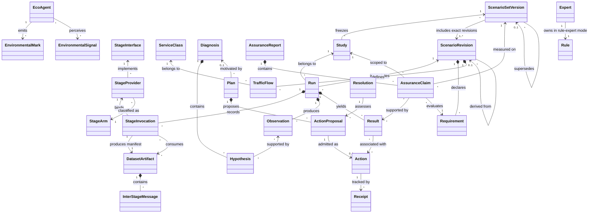

# Domain language and ontology

**Status: planned vocabulary.** [Index](README.md) · [RDF/OWL vocabulary](ontology.ttl)

The ontology provides a stable language across experiments. It is not a claim that an OWL reasoner implements diagnosis or planning. The accompanying Turtle vocabulary defines the principal classes and relations; application contracts enforce the stronger validation rules below.

## Ubiquitous language

| Term | Meaning |
| --- | --- |
| Study | Frozen comparison protocol binding all its runs to one scenario-set version |
| Scenario-set version | Immutable benchmark membership, exact member revisions/hashes, benchmark definitions and selection/aggregation weights |
| Scenario revision | Immutable specification of a synthetic world, workload and disturbance schedule |
| Run | One execution of a member scenario revision within a study, with a declared treatment and seed manifest |
| Stage interface | Versioned input/output seam independent of its implementing method |
| Stage provider | Versioned Null, Proposed or Oracle implementation binding for an interface |
| Stage invocation | One recorded execution of a bound provider, including its input, state, output and privilege lineage |
| Stage arm | Null, Proposed or Oracle experimental level; Null still supplies a valid output |
| Dataset artifact | Immutable serialised stage evidence with schema, hashes, time coverage and source lineage |
| Inter-stage message | Serialisable, logged record crossing a stage boundary, including no-op and error records |
| Information regime | Contract-only, privileged current-state or separately declared future-aware access |
| Network element | Synthetic node, device or application endpoint with declared capabilities |
| Link model | Connection with declared abstraction, parameters and observable behaviour |
| Service class | Traffic category with explicit requirements, such as SCADA or AMI |
| Traffic flow | Identifiable offered workload between endpoints, belonging to a service class |
| Requirement | A measurable predicate over a defined population, window and threshold |
| Observation | Value or event emitted by a declared source at a simulation time |
| Environmental signal | Local projection of an observation accessible to a specified agent |
| Interpretation | Versioned mapping from signals and internal state to an agent's assessment |
| Hypothesis | An explanation inferred from evidence, which can remain uncertain |
| Diagnosis | Collection of supported, competing or unresolved hypotheses |
| Goal | Desired predicate used to choose interventions; not an observed condition |
| Operator | Action schema with preconditions, predicted effects, scope and cost |
| Plan | Ordered or partially ordered proposed operator instances |
| Resolution | Decision about admissibility and conflicts among proposals |
| Action | Concrete command addressed to an actuator |
| Receipt | Evidence of command acceptance, rejection or application |
| Result | Measurements after an action, or after an explicit no-action decision |
| Assurance claim | Requirement assessment naming its study, scenario-set version and supporting evidence |
| Assurance report | Version-scoped claims, outcomes, limitations and reproducibility references for a run or study |
| Scenario-set revision proposal | Research artifact proposing a successor set, with parent version, hypothesis and motivating evidence; outside operational control |
| Expert | Versioned inference component with a declared evidence scope |
| Rule expert | Independent expert system owning exactly one production rule and its evaluation trace |
| Blackboard | Shared evidence and hypotheses controlled by an explicit expert activation policy |
| Eco-agent | Local satisfaction-seeking reactive entity with bounded perception and action |
| Satisfaction | Agent-specific predicate over local observations and internal state |
| Environmental mark | Expiring local record left for other agents to perceive |
| Resource claim | Intent to use a resource; a mark is not necessarily an enforceable reservation |
| Reservation | Granted resource use with explicit enforcement semantics |
| Conflict | Incompatible proposed uses of the same controlled resource |
| Stabilisation | Sustained bounded coordination behaviour under a declared criterion |
| Recovery | Return to service requirements after a disturbance, sustained over a declared window |

SCADA denotes the workload role, not proof of a complete industrial protocol model. AMI denotes a separately instrumented metering workload, not a renamed generic telemetry stream. A route switch is not a radio handover unless the simulator models that operation.

## Relationships and cardinalities

A result can exist without an action, as in a baseline run. Temporal association between action and result does not prove causation. A study-scoped report can assess multiple runs only within its frozen scenario set and recorded comparison design. A research synthesis across set versions retains separate version-scoped claims and the bridging protocol; it cannot erase benchmark differences.

The explicit provenance path is **study → scenario → run → stage → dataset**, with scenario-set membership binding study and scenario. A stage here is a StageInvocation, not just an algorithm name. It consumes existing datasets and owns a new output manifest even when no ordinary output messages are emitted. Study-level aggregation lists contributing run-scoped invocations rather than inventing one run. Replay-derived datasets reference the original inputs and the new provider/arm; they never overwrite the original lineage.

## Evidence types and truth discipline

Each assertion carries an epistemic kind:

| Kind | Example | Permitted use |
| --- | --- | --- |
| Declared | Configured offered load or intended disturbance | Scenario construction, evaluator ground truth |
| Observed | Packet enqueue timestamp from a trace | Evidence within its source and coverage limits |
| Derived | Deadline-miss ratio computed from packet events | Evidence with formula and source references |
| Inferred | Congestion hypothesis from queue and delay trends | Diagnosis with explanation and uncertainty |
| Predicted | Expected state after a route switch | Plan validation, never a measured success claim |

Capability status is a separate axis: **implemented**, **simulated**, **planned**, or **unsupported**. A capability record always includes its scope and supporting artifacts. Promotion to implemented or simulated requires executable evidence and evaluation within this repository.

Information regime is another independent axis. Simulator truth may be declared/observed by an instrumented truth source yet privileged and unavailable to a deployment-compatible provider. Oracle lineage remains explicit even when its payload satisfies the normal stage schema. Null guesses are labelled unvalidated, not promoted to observed truth.

Three-valued evidence semantics distinguish true, false and unknown. Missing telemetry does not mean zero loss or a healthy link. The ontology uses open-world semantics; a planner can use a closed finite state only after an explicit, logged projection. Unknown positive or negative preconditions block admission unless an operator explicitly handles uncertainty.

## Required constraints

- Every Study freezes exactly one ScenarioSetVersion before comparative measurement; membership, hashes and evaluation protocol cannot change during that study.
- Every Run belongs to exactly one Study and instantiates a revision that is a member of that study's frozen set.
- Every StageInvocation binds one interface/provider/version/arm and records all input/state references, output manifest and terminal status.
- Every stage boundary message is serialisable and logged with causal parent IDs; each DatasetArtifact has a producing invocation and immutable content/schema hashes.
- Each interface has Null, Proposed and Oracle provider specifications; a study requires supported providers for every selected arm and cannot substitute absence for Null.
- Oracle information permissions are logged and inherited by downstream datasets and claims; output-schema compatibility cannot erase privilege.
- Every AssuranceClaim and AssuranceReport identifies its study and scenario-set version/hash; every referenced run agrees with that scope.
- A successor scenario set is immutable and starts a new study; the operational loop has no authority to create or substitute it.
- Every Observation identifies one run, subject, metric, source, time/window, unit and epistemic kind.
- Every EnvironmentalSignal references its source observations, visibility scope and interpretation version.
- Every mark identifies issuer, resource, creation time, expiry, payload schema and locality.
- Every rule expert has exactly one owned production rule in the one-rule-expert treatment; support code may normalise inputs but may not hide extra domain rules.
- Every admitted action references a catalog operator, resolution record and current precondition evidence.
- Every result names its packet cohort or measurement window and missing-data treatment.
- Every assurance claim evaluates one requirement and resolves to met, violated, inconclusive or not applicable.
- A child scenario revision records its parent and research rationale; a scenario-set revision proposal records its parent set and motivating reports. Neither revises an active study.
- Unit conversion is explicit; RTT, one-way latency, offered load, goodput and queue occupancy are different metrics.
- Clock domains cannot be silently mixed: simulation time, host runtime and artifact creation time have separate fields.

These constraints are a specification for future schema and property validation. OWL domain/range declarations alone do not enforce them; SHACL or application validators may be added when runtime contracts are implemented.

## Competency questions

The ontology and event records must support queries such as:

1. Which observation and rule version justified this action?
2. Which assumptions were required to project telemetry into planner state?
3. Did this agent act on a local measurement, another agent's mark, or global information?
4. Which competing claims caused an action to be deferred?
5. Did an applied action improve SCADA while violating AMI service?
6. Did coordination stabilise while requirements remained unsatisfied?
7. Which reported metrics were measured and which were merely configured?
8. Which study, frozen scenario-set version, member revision and ablation produced this outcome?
9. Was a capability exercised in this run, or only described by a model?
10. What evidence motivates the proposed successor scenario set, and which new study will evaluate it?
11. Are the compared controllers measured on the same frozen set, or is benchmark drift confounded with controller change?
12. Which stage invocation, arm and dataset produced this claim, and can its inputs be replayed?
13. Does this Oracle comparison change information access, optimisation quality, execution assumptions or several of them?
14. Is a measured gap conditional stage headroom, an information-limit result, or only a replay result without a counterfactual simulation?

## Identity and compatibility

Use opaque synthetic IDs for individuals and versioned URNs for the ontology. IDs remain stable within an immutable artifact; changing a workload or requirement creates a new scenario revision and a successor scenario-set version. Changed set membership or scoring also creates a successor set, even if some member scenarios are reused. A new study may reuse an unchanged frozen set to compare new controllers. Entity identifiers and types express this domain model and must not encode unverified frequency, ownership or deployment properties.
