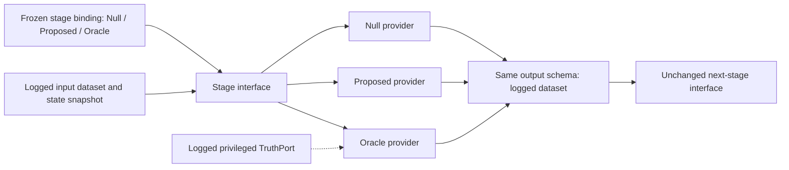

# Stage substitution, oracles and headroom

**Status: Null providers implemented for all seven stages; Proposed and Oracle providers remain specifications.** [Index](README.md)

Ablation replaces behaviour while preserving the contract. Every stage has at least a Null, Proposed and Oracle provider. The stage, its typed output, its invocation record and its place in the provenance chain remain present in every arm.

| Arm | Role | Question |
| --- | --- | --- |
| Null | Explicit trivial policy, preserving schema, safety and authority | Does the proposed behaviour add value over this declared baseline? |
| Proposed | The research method under test | How much does it help in this configuration? |
| Oracle | A specified exact or privileged reference with documented scope | What headroom remains under the reference's assumptions? |

Random, first-match and abstention policies are different Null variants. Choose and version one per comparison; do not change the Null policy after seeing results. A Null diagnosis is not a missing DiagnosisRecord, and a no-planning arm still emits a valid PlanProposal.

## Required provider families

| Stage | Null substitute | Proposed provider | Oracle reference |
| --- | --- | --- | --- |
| Telemetry | Empty dynamic observations with explicit unknowns, watermark and completeness | Contract-constrained trace normalisation, quality and local projection | Exact current simulator quantities through a separately declared truth projection |
| Diagnosis | First candidate in a fixed declared ordering, labelled unvalidated guess; abstain if no candidate | Single expert, one-rule experts or local dissatisfaction assessment | Exact current ground-truth diagnosis projected into the same label ontology |
| Planning | No multistep search: first feasible catalog action as a one-step plan; explicit no-op if none | STRIPS-domain search, GPS, A* or local action proposal | Certified optimal plan for the declared finite model, objective, horizon and action catalog |
| Resolution | First feasible proposal in a fixed order; defer remaining conflicts | Declared central arbitration or local eco coordination | Exact feasible proposal allocation under the same catalog and objective |
| Action | Suppress mutation and emit a no-op/suppressed receipt | Simulator adapter execution and reconciliation | Verified direct simulator application of the admitted effect under matched authority and declared timing |
| Result | Receipt-only summary with service outcomes unknown | Cohort-based measured outcome extraction | Independent extraction from complete simulator events with exact identities/times |
| Assurance | Explicit inconclusive claims with evidence inventory | Requirement/coverage evaluation and scoped report | Independent reference evaluation against full truth and the same frozen requirements |

All stages are kept even when their output is empty, unknown, no-op, rejected or inconclusive. Unsupported Oracle support blocks the affected study cell; it is not replaced with a heuristic while retaining the Oracle name.

Schema validity and goal achievement are separate. A first-feasible or no-op PlanProposal can be structurally valid while leaving goals unmet; it records that status rather than claiming a solution. Every plan labelled goal-achieving must pass full symbolic goal validation.

Oracle execution and result extraction may coincide with Proposed in a sufficiently direct simulator integration. Declare that equivalence and do not invent a gap. Oracle assurance supplies privileged truth-based verdicts, not evidence that deployment telemetry could justify those verdicts.

The fixed study evaluator scores every treatment, including assurance-stage substitutions. Replacing the assurance provider does not replace the experiment's scoring rules. Otherwise an always-positive reporter could appear to improve service merely by changing its claims.

## Oracles have information and optimisation contracts

The [selected v1 references](v1-scope.md#finite-references-and-method-priorities) fix bounded
configuration planning, proposal-subset resolution and current operational truth predicates.
The separate information-ambiguity problem has an explicit finite reward and prior. These
bindings do not claim an exact optimiser for stochastic ns-3 service outcomes.

Every Oracle binding declares its truth access, time horizon, objective, allowed action set, computational budget, optimality certificate or reference status, and latency assumptions. A perfect diagnosis is meaningful only for labels the simulator actually establishes; an injected impairment is not proof of an unmodelled physical root cause.

The initial stage Oracle arm uses **oracle_state**: current simulator truth at the decision watermark, never future arrivals, future random draws or an undisclosed disturbance schedule. A downstream Oracle can request truth independently of an upstream telemetry arm; this is an intentional, logged information intervention. Null/Oracle interactions can therefore reveal that bypass rather than a deployment capability.

Additional diagnostic comparisons distinguish **contract_only** exact/best-certified references from **oracle_state**. A contract-limited reference has the same observations and history as Proposed; it is not promised perfect diagnosis under partial observability. An optional **oracle_future** clairvoyant bound is a separate supplemental study, excluded from the initial three-arm factorial.

Oracle optimality is scoped to a finite model and objective. Exact planning over a symbolic configuration goal need not maximise measured packet service. Use a certified service model or a tractable enumerated control problem before claiming an assurance upper bound. For stochastic transitions, define expected or risk-sensitive cost under a declared model; knowing the present state does not reveal the future sample path.

An exact solver that times out supplies a bound/unknown outcome, not an optimal solution. A high-budget heuristic is a reference provider, not a certified Oracle. Select screening domains where the required Oracle is tractable and supported. Report symbolic optimal cost, realised service and any gap between model prediction and measurement separately.

## Information sufficiency and bottleneck attribution

Let U be a preregistered higher-is-better service measure; retain the underlying per-class requirements rather than hiding them in an undeclared scalar. On paired runs, report:

- Proposed minus Null: contribution over the specific trivial baseline.
- Oracle minus Proposed: conditional headroom with all non-varied stages fixed.
- Contract-limited reference minus Proposed: algorithmic headroom at fixed information, where such a reference can be established.
- Privileged reference minus contract-limited reference: information-access headroom under matched objectives and downstream methods.

A small perfect-diagnoser gap does **not** establish a telemetry bottleneck. It may indicate an adequate diagnoser, a downstream planning/action limit, a saturated metric, or low power. First inspect diagnostic correctness and downstream stage interactions. Report uncertainty on paired differences and the precision needed to distinguish a practically meaningful gap.

A telemetry-sufficiency claim needs an observation intervention or an identifiability argument. For example, hold planning/resolution/execution fixed and compare contract-limited and privileged diagnosis while adding or withholding specified signals. Find observed histories compatible with distinct hidden states requiring different decisions, and measure the unavoidable service loss under that ambiguity. The [telemetry contract](../../system/telemetry-contract.md#measuring-telemetry-sufficiency) defines the access boundary.

Claims about reachable assurance must name the model, observation contract, action catalog, objective and proof or empirical scope. A component Oracle is not automatically a global upper bound, and a privileged result is not deployable assurance evidence.

## Configuration and replay seams

The branches are alternative bindings, not simultaneous calls. Every inter-stage message is serialised and logged, including errors, receipts, marks crossing boundaries and no-ops. The provenance chain is **study → scenario → run → stage → dataset**, with scenario-set version/hash attached at study level. StageInvocation records identify provider, arm, configuration, state and random-stream references.

Boundary playback feeds N's recorded outputs into N+1. Substitution replay feeds N's recorded inputs through the replacement and logs the new outputs supplied to N+1. An action-changing substitution needs a new simulator continuation to support service-effect claims. See the normative [interfaces and replay contract](../../system/interfaces.md).

## Bounded experimental design

The initial four factors are **telemetry, diagnosis, planning and resolution**, each with Null/Proposed/Oracle. Action, result and assurance providers and the independent evaluator are held fixed. Their three provider families remain required and are evaluated in separately budgeted stage studies; they are not silently multiplied into the first factorial.

Screen the full **3^4 = 81 configurations** on a frozen small scenario set where all Oracle providers are supported. Use this to estimate preregistered main effects and interactions. Then freeze a new study on the full scenario set with an all-Proposed reference and one-factor-at-a-time Null/Oracle substitutions: **1 + 4 × 2 = 9 configurations**. The full-set study estimates conditional effects around that reference; it cannot establish that interactions are absent on unseen cases.

The [experiment design](experiments.md#declared-factorial-and-confirmatory-design) fixes the budget formula, screening-to-confirmation separation, interactions and reporting obligations. STRIPS/GPS/A*, expert organisation and eco mechanisms are within-arm method comparisons, separately declared and budgeted rather than expanding Proposed into hidden extra levels.
