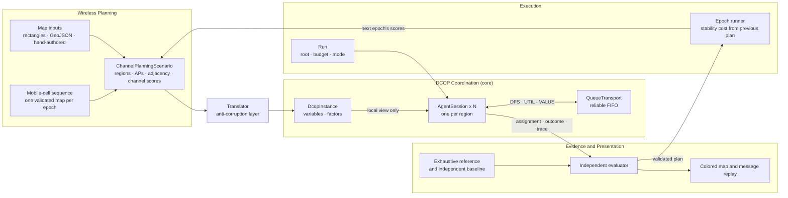
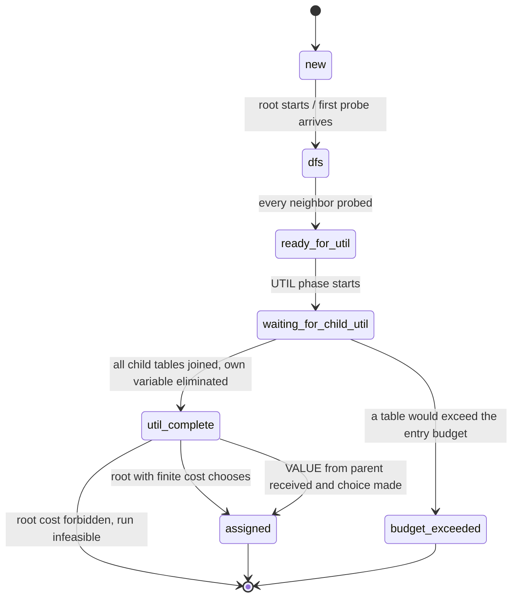

# Architecture

**Status: DFS, UTIL and VALUE implemented; independent evaluation, demonstration and
mobile-cell epochs planned. Revision: 0.3. Date: 2026-09-23.**

[Study design](README.md) · [Package](../../software/dcop_channel_assignment/README.md)

This page describes how the system is built: who owns which model, what an agent can see,
which messages cross which boundary, and the decisions that shape it. Each element is
marked **implemented** or **planned**.

## Overview

Read the diagram left to right. A map becomes a validated scenario; the translator turns
wireless terms into generic variables and factors; each agent receives only its local view
and talks only through the transport; the evaluator checks the result without trusting the
solver. The single feedback path, used only by mobile-cell epochs, returns a validated plan
to Wireless Planning as the next epoch's stability costs. The solver never learns that epochs
exist.

## Bounded contexts

| Context | Owns | Exposes | Modules | Status |
| --- | --- | --- | --- | --- |
| **Wireless Planning** | Region, AP and channel identity; map geometry; adjacency derived from shared boundaries; channel scores; mobile-cell sequences | A validated scenario snapshot per epoch | `wireless.py`, `geography.py`, `curitiba.py`, `fixtures.py` | implemented; hand-authored maps and mobile-cell sequences planned |
| **Translation** | The mapping from wireless terms to DCOP terms | `to_dcop(scenario) -> DcopInstance` | `translation.py` | implemented |
| **DCOP Coordination** (core) | Immutable instance; agent sessions, their phase state and pseudo-tree position; cost tables | Local views, typed messages, solve outcome | `dcop.py`, `tables.py`, `agents.py`, `protocol.py` | implemented |
| **Execution** | One run's configuration (root, budget, mode); epoch ordering for mobile cells | `solve(...)` and the CLI | `agents.py`, `__main__.py` | `solve` and inspection CLI implemented; solving CLI and epoch runner planned |
| **Evidence and Presentation** | Evaluation records, exhaustive reference, independent baseline, figures | Verdicts, comparison tables, colored map, replay | `visualize.py` | replay implemented; evaluator, reference, baseline and colored map planned |

Dependencies point one way: Wireless Planning → Translation → DCOP Coordination, with
Execution composing them and Evidence reading their outputs. The solver imports nothing
from wireless, geography, rendering, experiment policy or ECoRA. Evidence cannot change a
scenario, an agent's choice or a run's configuration.

## What an agent can see

An agent is an `AgentSession` holding:

- its own variable and domain;
- its neighbors' identifiers and domains;
- the factors that involve its variable (its unary score and its incident edge constraints);
- a send port, which can send a message and nothing else.

It cannot read another agent's state, the global instance, the transport's queue or trace,
or the harness. The harness chooses the root, wires local views to agents and drains the
queue; it makes no traversal, table or channel decision. This is an information-access
boundary enforced by construction, not a security or privacy proof.

## Protocol

Three phases run in order. Every message carries a run ID, sender, recipient, per-sender
sequence number, kind and typed payload. Agents reject wrong-run, duplicate, out-of-phase
and wrongly scoped messages explicitly.

| Phase | Kind | Direction | Payload | Count | Status |
| --- | --- | --- | --- | --- | --- |
| DFS | `dfs_explore` | ancestor → neighbor | Ancestor path | one per edge | implemented |
| DFS | `dfs_seen` | visited neighbor → prober | none | back edges | implemented |
| DFS | `dfs_return` | child → parent | Subtree separator | one per tree edge | implemented |
| UTIL | `util` | child → parent | Cost table over the child's separator | N - 1 | implemented |
| VALUE | `value` | parent → child | Assignment of the child's separator | N - 1 | implemented |

DFS sends exactly two messages per edge (34 on the 17-edge grid, 58 on the 29-edge core,
132 on the 66-edge metropolitan map). UTIL and VALUE send one message per tree edge. The
message count is linear in the graph; the cost of DPOP lies in UTIL table size.

### DFS: building the pseudo-tree (implemented)

The root probes its neighbors one at a time in ascending ID order. An unvisited neighbor
adopts the ancestor path, becomes a child and explores its own neighbors; a neighbor already
on the path answers SEEN, which makes that edge a back edge. When an agent has no neighbors
left to probe, it returns its separator to its parent. The result is a pseudo-tree: a
spanning tree in which every non-tree edge joins an ancestor and a descendant, so no edge
crosses between sibling subtrees.

An agent's **separator** is the set of its ancestors that its subtree is connected to: its
parent, its pseudo-parents, and every ancestor in its children's separators. It is computed
locally from probe paths and children's RETURN messages. Each unary factor is owned by its
agent; each edge constraint by its deeper endpoint, so every factor counts exactly once.

### UTIL: costs flow up (implemented)

An agent waits for a table from every child, joins those tables with the factors it owns,
and eliminates its own variable by minimization. The result is a table over its separator:
for each combination of ancestor channels, the best cost its whole subtree can achieve. The
agent keeps, for each such combination, which channel achieved that best cost (its
conditional choice), and sends the table to its parent. At the root the separator is empty
and the table is one number: the optimal total cost, or forbidden if no conflict-free
coloring exists.

The table over a separator of size `k` has `4^k` entries, and the join before elimination has
`4^(k+1)`. That is the whole cost story of RQ3: 1,024 entries at `k = 4`, 16,384 at `k = 6`,
16,777,216 at `k = 11`.

### VALUE: choices flow down (implemented)

1. When UTIL completes with a finite cost, the harness tells the root to start VALUE. The
   root picks its conditional choice for the empty context and sends each child the
   assignment of that child's separator.
2. An agent that receives VALUE checks that it came from its parent, after its own UTIL,
   and that the assignment covers exactly its own separator with in-domain values. It looks
   up its conditional choice for that context and sends each child the assignment of the
   child's separator. A child's separator lies within its parent's separator plus the
   parent itself, so the parent always holds every value the child needs.
3. A leaf that has chosen its channel is finished. The run completes when every agent has
   chosen once.

The harness then reads each agent's own choice into the run's assignment and checks, as an
internal guard, that the assignment costs exactly the root's optimum. The independent
evaluator (CA-11) is a separate check.

If the root's cost is forbidden, the root refuses to start VALUE. No agent receives a
context, no channel is fabricated, and the run's outcome is `infeasible`. Every agent then
ends in `util_complete`, which is terminal for an infeasible run.

## Agent lifecycle

All states are implemented. A message that does not fit the current state is a protocol
error, never ignored.

## Run outcomes

| Outcome | Meaning | Carries |
| --- | --- | --- |
| `optimal_cost` | UTIL finished with a finite root cost | Cost; with VALUE, the complete assignment |
| `infeasible` | UTIL finished and the root cost is forbidden | No cost value, no assignment |
| `budget_exceeded` | A table would exceed the declared entry budget | Required and allowed entry counts; messages delivered so far; no cost |
| execution error | A protocol or input violation | The error; never scored as any of the above |

A budget stop is not evidence of infeasibility, and an infeasible result is never given a
partial assignment.

## Invariants and how they are checked

| Invariant | Checked by | Status |
| --- | --- | --- |
| Adjacency derives from geometry; the graph is simple, connected and planar | Scenario validation, on every input | implemented |
| One variable per region, one factor per edge, scores unchanged by translation | Translation tests with exhaustive enumeration of a small map | implemented |
| The pseudo-tree spans all agents and every non-tree edge joins ancestor and descendant | `validate_pseudotree`, after every DFS | implemented |
| Every factor is owned exactly once | Post-DFS ownership check | implemented |
| Each UTIL table's scope equals its sender's separator | Receiving agent, on every UTIL message | implemented |
| The root cost equals the exact optimum | Tests against exhaustive enumeration, every root | implemented |
| Each VALUE context covers exactly the receiver's separator and comes from its parent | Receiving agent | implemented |
| Every agent chooses exactly once, and the assignment costs what the root reported | `solve` guard; tests with an enumeration-based evaluator | implemented |
| The reconstructed assignment is complete and conflict-free | Independent evaluator, sharing no code with the solver | planned (CA-11); tests check it today |
| An infeasible run yields no assignment and no VALUE message | K5 tests under every root; generated infeasible instances | implemented |
| Epoch `t`'s stability costs derive only from epoch `t - 1`'s validated plan | Epoch runner tests | planned |

## Mobile cells in the architecture (planned)

A mobile cell is owned by Wireless Planning as a `MobileCellSequence`: an ordered list of
epochs, each a complete, validated map in which the mobile cell is one region. The epoch
runner in Execution solves epoch 1 plainly. For each later epoch it takes the evaluator's
validated plan from the previous epoch, asks Wireless Planning to add the stability cost to
each surviving AP's scores, and solves the resulting static instance from scratch.

This keeps the change out of the core: to the solver, a stability cost is an ordinary unary
cost, and each epoch is an ordinary run. Solving from scratch forgoes incremental repair,
which a dynamic DCOP algorithm would provide; for maps of this size a full solve is cheap,
and the reassignment count (C5) measures what matters to users either way.

## Decisions

| ID | Decision | Rationale |
| --- | --- | --- |
| D1 | DPOP, not ADOPT | Exact with a linear message count; resource use is explained by separator width alone; each phase can be checked by hand |
| D2 | Forbidden is an explicit value, not a large penalty | No finite optimum can hide a conflict; infeasibility is certain rather than inferred from a big number |
| D3 | Each edge constraint is owned by its deeper endpoint | Every factor counts once, and the owner has the other endpoint in its separator |
| D4 | Agents run in one process over an in-memory queue | The distribution that matters is informational: an agent sees only its local view and messages. Threads or processes would add nondeterminism without changing what an agent can know |
| D5 | Determinism: ascending neighbor order, lowest channel on ties, declared root | Identical inputs give identical trees, tables and assignments, so a run is its own reproduction |
| D6 | Per-table entry budget, checked before allocation | An oversized table stops with `budget_exceeded` before memory is exhausted, and is never mistaken for infeasibility |
| D7 | The solver uses only the Python standard library | The algorithm is original; Shapely and NetworkX serve map geometry and planarity validation only |
| D8 | The evaluator shares no code with the solver | A solver bug cannot also hide in its own check |
| D9 | Mobile cells as re-solved snapshots with a stability cost | Keeps the protocol static and verifiable; the stability cost is an ordinary unary cost |
| D10 | No VALUE on an infeasible root | Nothing to reconstruct; sending a context would invite a fabricated channel |

## Known limits

- Table size grows as `4^(k+1)`; the 29-region map cannot complete in the pure-Python
  table algebra. This is DPOP's documented behavior, shown, not hidden.
- The transport is reliable and ordered. Lost, duplicated or reordered messages are rejected
  as errors, not tolerated.
- No leader election: the harness declares the root.
- Costs and topology are static within a solve; mobility is handled between solves.
- Adjacency is a planar surrogate for interference, not a radio model.
